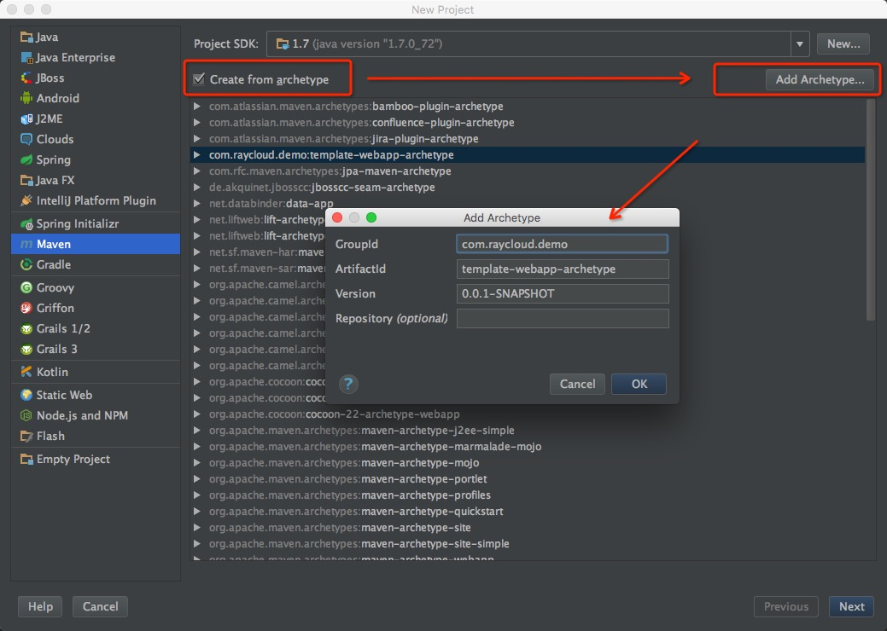
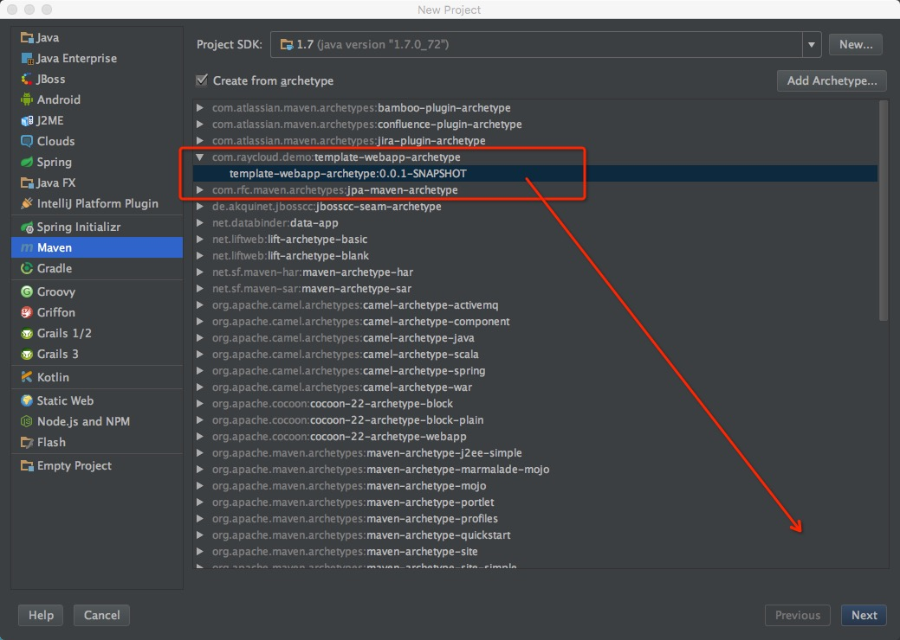
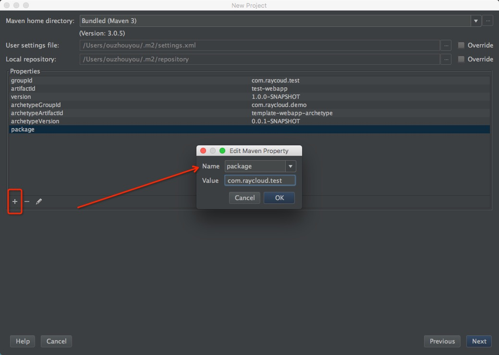

# JAVA模板工程

这是一个结合 spring spring mvc dubbo ibatis metaq ons的示例代码
pom.xml几乎涵盖了公司常用的组件依赖,可以根据情况自行注释

ibatis相关的代码由 http://git.superboss.cc/raycloud/XBatis-Code-Generator 自动生成

# 如何快速的部署本工程
* 方式一直接下载zip源码包  http://git.superboss.cc/raycloud/raycloud_java_demo/repository/archive.zip?ref=master

* 注意:方式二跟方式三都依赖maven,由于maven本身问题 增加一个HOST  127.0.0.1 repo.maven.apache.org可加速

* 方式二 通过maven命令模板构建   mvn  -DgroupId=com.raycoud.test -DartifactId=test-webapp -Dversion=1.0.0-SNAPSHOT -Dpackage=com.raycloud.test    -DarchetypeGroupId=com.raycloud.demo -DarchetypeArtifactId=template-webapp-archetype -DarchetypeVersion=0.0.1-SNAPSHOT org.apache.maven.plugins:maven-archetype-plugin:RELEASE:generate

        把groupId artifactId version package改成你自己的名称,package为模板自动创建包名
        maven会自动替换参数构建一个新的模板工程
* 方式三 通过IDEA构建模板工程
 * 增加一个新的模板
    
    
 * 选择刚刚创建的模板

 * 增加一个package参数
 

# maven的模板项目是如何构建的?
* 模板代码编写完毕之后 在根路径使用以下命令  mvn archetype:create-from-project
* 执行成功之后  进入target目录会看到generated-sources目录,这个目录就是生成好的模板
* cd target/generated-sources/archetype
* mvn install 就已经安装好了.
* 可以编辑 src/main/resources/META-INF/maven/archetype-metadata.xml 移除.idea等不需要的文件
* 最后deploy到私服.